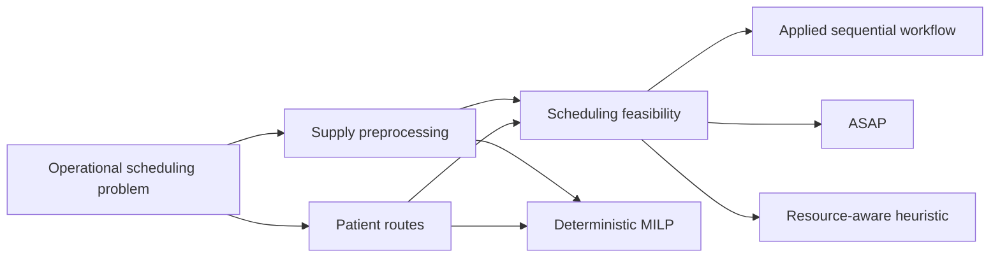

# Multi-Appointment Scheduling for Oncology Care

Research and applied optimization project for coordinating dependent oncology appointments under limited medical capacity.

**Status:** Completed research & portfolio archive.

This repository is an archive by design. It documents finished applied and research work: it is not an actively maintained scheduling product, it is not connected to live FALP systems, and it does not distribute any real operational dataset. Nothing here requires an active Gurobi license to read or evaluate.

## Project overview

This project addressed appointment scheduling for oncology patients in an applied collaboration with **Fundación Arturo López Pérez (FALP)**, a Chilean oncology-care foundation, using FALP's real operational scheduling data. FALP patients frequently require several coordinated appointments — imaging, laboratory work, specialist consultations, procedures — rather than a single independent visit, and those appointments compete for the same limited clinical resources (physicians, rooms, equipment, agenda slots).

The work had two complementary parts. An applied prototype processed FALP's own operational scheduling data — physician and resource availability, blocked capacity, patient demand, and derived patient routes — to support sequential, operator-checked appointment allocation. A parallel research effort formalized the same problem mathematically: an ASAP heuristic, a resource-aware heuristic, and a deterministic mixed-integer linear programming (MILP) model solved with Gurobi, developed as part of a research manuscript.

The original applied prototype was built and evaluated directly against FALP's real operational data: appointment logs, physician schedules, blocked-capacity records, and patient routes. That data is confidential, and it is not included, reproduced, or statistically approximated anywhere in this repository.

This public repository is a clean-room reconstruction, written after the fact, to document what was built and how. It reimplements the computational structure of the applied prototype and the research methods against fully synthetic, independently generated data, so the engineering and methodology can be inspected without exposing any confidential healthcare information.

## The problem

A single oncology patient's care is rarely one appointment. It is a **route**: an ordered set of appointments — a first consultation, imaging, a lab test, a follow-up, a procedure — where some appointments cannot happen until others are completed.

```
patient route → temporal dependencies → compatible resources → limited capacity → appointment allocation
```

This makes the problem materially harder than conventional single-appointment scheduling:

- **Temporal dependencies** — an appointment may only be booked a minimum number of days after its predecessor, and preferably before a soft maximum.
- **Compatible resources** — an appointment may require a specific physician and agenda, or any resource within a compatible service/section/modality set.
- **Limited and reducible capacity** — each resource-day has finite capacity, which can be further reduced by blocked time and partially extended through overbooking.
- **Sequential, path-dependent decisions** — assigning one appointment changes the remaining capacity and the feasible window for the next appointment on the same route, and for other patients competing for the same resources.
- **Unresolved outcomes** — not every appointment can be placed within the available horizon and capacity; the system must represent that outcome explicitly rather than fail silently.

## What was developed

### Applied scheduling prototype

The historical applied prototype, developed and tested against FALP's operational data, covered:

- extraction of per-patient appointment demand and derived route structure from historical appointment logs;
- preprocessing of medical-resource supply: physician/agenda availability, blocked capacity, and overbooking allowances;
- sequential, dependency-aware appointment allocation, one patient event at a time;
- explicit handling of unresolved ("pending") appointments when no feasible slot existed;
- an operator-facing, decision-support workflow — proposed dates were confirmed or adjusted by a human operator rather than assigned fully automatically.

This was a decision-support prototype implemented and tested against real operational data, not an autonomous production scheduler.

### Research methodology

The research component formalized the same problem as a scheduling methodology, developing:

- **ASAP** — a greedy heuristic that assigns each event to the earliest feasible appointment;
- **Resource-aware** — a greedy heuristic that instead favors the feasible appointment with the strongest remaining resource capacity inside the preferred timing window, trading immediacy for load balancing;
- **Deterministic MILP** — a mixed-integer linear program that jointly decides every appointment over a finite planning horizon, subject to dependency/timing constraints and per-resource capacity constraints, minimizing total tardiness plus a penalty for appointments that cannot be resolved within the horizon;
- Gurobi as the solver used to obtain optimal or best-known solutions to the MILP.

This methodology is associated with a research manuscript (see **Related research** below). No experimental results from that manuscript are reproduced in this repository.

## Architecture and workflow

```
src/appointment_scheduling/
├── preprocessing/
├── routes/
├── scheduling/
├── schedulers/
├── research/
├── optimization/
└── synthetic/
```

- **`preprocessing/`** — validates and joins raw supply, blocked-capacity, and resource-mapping tables into a single deterministic availability table.
- **`routes/`** — converts route records into immutable per-patient dependency graphs (DAGs) and shared pathway templates.
- **`scheduling/`** — combines routes and availability into a copy-on-write feasibility state that answers "what appointments are currently possible."
- **`schedulers/`** — implements the applied, forward-only sequential scheduling workflow behind a pluggable decision rule.
- **`research/`** — implements the ASAP and resource-aware heuristics, shared comparison metrics, and an isolated multi-policy experiment runner.
- **`optimization/`** — implements the solver-independent deterministic MILP formulation and an optional Gurobi adapter.
- **`synthetic/`** — generates and validates the fully synthetic demo datasets that stand in for the original confidential operational data.



At the event level, the same feasibility semantics apply across every method:

```
Patient route → Eligible event → Compatible appointment opportunities
    → Timing + resource + capacity feasibility → Scheduling decision
    → Capacity update → Next route event
```

An event becomes eligible once its predecessors (if any) are resolved. The feasibility engine narrows the search to appointment opportunities compatible with the event's resource requirements, timing window, and remaining capacity. A decision rule — the applied earliest-feasible rule, or a research policy such as ASAP or resource-aware — selects (or defers) an outcome; the shared state layer records it, consumes capacity, and re-evaluates downstream eligibility. The deterministic MILP applies the same feasibility semantics but decides every event jointly rather than one at a time.

## Methods

| Method | Type | Main idea |
|---|---|---|
| Sequential applied workflow | Applied decision-support baseline | Sequentially evaluates feasible appointment alternatives in deterministic patient/route order |
| ASAP | Research heuristic | Assigns the earliest feasible appointment |
| Resource-aware | Research heuristic | Favors the feasible appointment with the strongest current resource availability within the preferred timing window |
| Deterministic MILP | Mathematical optimization | Jointly schedules all appointments over the finite horizon to minimize tardiness and post-horizon penalties |

No method is presented as superior to another. The repository's synthetic experiments demonstrate that the software architecture supports fair, isolated comparison — they are demonstration and validation output, not empirical research findings.

### Mathematical optimization

The deterministic model minimizes

```
minimize  Σ tardiness  +  M × Σ penalized post-horizon events
```

over binary assignment variables that select a compatible appointment opportunity for each patient event (or an explicit post-horizon outcome when none is available), subject to:

- dependency/precedence constraints between events on the same route;
- a hard minimum spacing after each predecessor;
- a soft preferred maximum spacing, which contributes to tardiness rather than making a late appointment infeasible;
- per-opportunity capacity constraints, with standard capacity consumed before overbooking capacity;
- an explicit penalty for events that cannot be placed within the finite planning horizon.

The deterministic optimization model was implemented using Gurobi as part of the original research work. The public repository preserves the formulation and solver integration for methodological documentation; an active Gurobi license is not required to inspect the implementation. The full formulation, notation, and historical-fidelity notes are documented in [`docs/deterministic_milp.md`](docs/deterministic_milp.md).

## Public reconstruction and confidentiality

| Original project component | Public representation | Reconstruction status |
|---|---|---|
| Historical route/periodicity extraction from appointment logs | `routes/` | Clean-room reimplementation |
| Medical-supply preprocessing, blocked-capacity netting, overbooking split | `preprocessing/` | Clean-room reimplementation |
| Sequential, operator-confirmed appointment allocation with dependency checks and unresolved ("Pendiente") state | `schedulers/` + `scheduling/` | Clean-room reimplementation |
| Manual route data-entry tooling | — | Not reconstructed (operational tooling, not a scheduling method) |
| ASAP and resource-aware heuristics | `research/policies/` | Clean-room reimplementation of the research heuristics |
| Deterministic MILP (Gurobi) | `optimization/` | Clean-room reimplementation of the formulation |
| Confidential institutional appointment, supply, and route data | `data/demo/*.csv` | Replaced entirely by independently generated synthetic fixtures |
| — | `tests/`, `docs/`, `examples/` | Public software-engineering additions; did not exist in the historical project |

The public implementation is a clean-room reconstruction. It preserves the computational structure and methodology of the original work while replacing confidential datasets and refactoring legacy implementation details — for example, the historical prototype updated capacity through broad row-matching updates and had scripts execute one another directly, while the public reconstruction uses exact-opportunity capacity keys and ordinary module imports. These are documented software-engineering corrections, not changes to the underlying scheduling methodology. See [`docs/project_context.md`](docs/project_context.md) and [`docs/applied_prototype.md`](docs/applied_prototype.md) for the full provenance discussion.

All data in this public repository are synthetic fixtures generated independently for software demonstration. They reproduce selected **structural** characteristics needed to demonstrate the scheduling logic — dependencies, timing windows, resource compatibility, capacity, and overbooking — and nothing else. They do **not** reproduce:

- patient records or any patient-identifying information;
- the statistical distributions of the original operational data;
- real operational volumes or capacity levels;
- clinical protocols or treatment pathways;
- institutional agenda identifiers, physician names, or facility capacities.

This repository is maintained as a portfolio artifact, a methodological archive of the scheduling approaches developed during the project, and evidence of completed applied and research contributions. It is **not** a production healthcare system, is **not** connected to FALP systems or any live scheduling infrastructure, is **not** a maintained or supported scheduling service, and is **not** distributed with any real operational or patient data.

## Technical details and documentation

- **Language and libraries:** Python, pandas, NumPy.
- **Optimization:** mixed-integer linear programming (MILP), with Gurobi as the historical and optional solver.
- **Testing:** pytest.
- **Historical data sources:** Excel-based operational exports, used only in the original applied prototype and never included here.

Further documentation:

- [`docs/project_context.md`](docs/project_context.md) — full provenance discussion.
- [`docs/applied_prototype.md`](docs/applied_prototype.md) — the historical applied workflow, concept by concept.
- [`docs/supply_preprocessing.md`](docs/supply_preprocessing.md), [`docs/route_model.md`](docs/route_model.md), [`docs/scheduling_state.md`](docs/scheduling_state.md), [`docs/sequential_scheduler.md`](docs/sequential_scheduler.md) — the feasibility engine and applied workflow.
- [`docs/research_policies.md`](docs/research_policies.md), [`docs/deterministic_milp.md`](docs/deterministic_milp.md) — the research heuristics and the MILP formulation.
- [`docs/data_dictionary.md`](docs/data_dictionary.md) — the synthetic dataset schemas.

To run the code locally:

```bash
python -m pip install -e ".[dev]"
pytest
```

The public reconstruction includes regression and validation tests for the synthetic fixtures and reconstructed scheduling logic; this test suite belongs to the public reconstruction and was not part of the historical project. The Gurobi adapter is an optional extra (`pip install -e ".[dev,optimization]"`) and is not required to run the test suite or to read the optimization module.

## Related research

A scientific manuscript associated with this work is being finalized. Publication information will be added here when publicly available.

## Author

Franco Quezada Valenzuela
