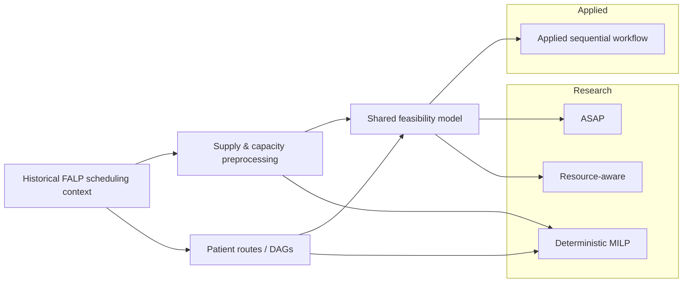

# Multi-Appointment Scheduling for Oncology Care

<p align="center">
  <strong>Applied healthcare scheduling · Operations Research · Heuristics · MILP</strong>
</p>

<p align="center">
  
  
  
  
  
</p>

> **Status — Completed research & portfolio archive.**  
> This repository documents completed applied and research work. The historical project used real operational data from **Fundación Arturo López Pérez (FALP)**; this public reconstruction contains only independently generated synthetic data.

[**Applied prototype**](docs/applied_prototype.md) · [**Research methods**](docs/research_policies.md) · [**MILP formulation**](docs/deterministic_milp.md) · [**Project context**](docs/project_context.md) · [**Synthetic data schema**](docs/data_dictionary.md)

---

## At a glance

| Applied problem | Research methods | Public portfolio reconstruction |
|---|---|---|
| Coordinate multiple dependent oncology appointments under limited medical capacity | ASAP, resource-aware scheduling, deterministic MILP | Reimplements the core methodology with synthetic data and safer modular interfaces |
| Real operational scheduling data, routes, agendas, blocked capacity and overbooking | Precedence constraints, time-lags, tardiness and finite-horizon scheduling | No patient records, clinician identities, real capacities or institutional datasets |
| Sequential operator-supported appointment allocation | Gurobi used for the deterministic optimization model | Built as an inspectable archive of completed work, not as an active production service |

## Project overview

This project addressed a practical oncology scheduling problem in collaboration with **Fundación Arturo López Pérez (FALP)** in Chile. Unlike conventional appointment scheduling, oncology care often requires a patient to complete a **route of interdependent medical tasks**: consultations, examinations, laboratory work and procedures must be coordinated while respecting temporal relationships and competing for limited resources.

The work combined two complementary components:

- **Applied scheduling prototype** — processing operational appointment demand, patient routes, resource availability, blocked capacity and overbooking to support sequential appointment allocation with an operator in the loop.
- **Operations Research methodology** — formalizing the same scheduling problem through online heuristics and mathematical optimization, including ASAP scheduling, a resource-aware rule and a deterministic mixed-integer linear programming model.

The historical implementation was developed and evaluated against FALP operational data. Those datasets are confidential and are **not** distributed here. This repository is a clean-room portfolio reconstruction created after the project was completed so that the engineering and methodology can be inspected without exposing healthcare information.

## The scheduling problem

A patient does not request a single independent appointment. Instead, each patient follows a route represented by a directed acyclic graph (DAG), where tasks may have one or several predecessors and must respect minimum and recommended maximum time-lags.

```text
Patient arrival
      ↓
Patient route / DAG
      ↓
Eligible medical task
      ↓
Compatible resources + available capacity
      ↓
Feasible appointment opportunities
      ↓
Scheduling decision
      ↓
Capacity update and next route event
```

The resulting problem combines several sources of complexity:

- **Precedence and time-lag constraints** between appointments.
- **Resource compatibility**, including physicians, agendas, sections and other resource categories.
- **Finite capacity**, affected by blocked slots and possible overbooking.
- **Path-dependent decisions**: assigning one event changes both the patient's future feasible window and the capacity available to other patients.
- **Incomplete routes** when an appointment cannot be placed within the available planning horizon.

## What was developed

### Applied scheduling prototype

The historical applied work included:

- extracting appointment demand and deriving patient-route information from operational records;
- preprocessing physician/agenda supply, blocked capacity and overbooking allowances;
- generating feasible appointment alternatives from route, timing and resource constraints;
- sequentially assigning patient events while updating the remaining capacity;
- representing unresolved appointments explicitly when no feasible option existed;
- supporting an **operator-confirmed decision workflow**, rather than presenting the prototype as an autonomous production scheduler.

The public modules [`preprocessing/`](src/appointment_scheduling/preprocessing), [`routes/`](src/appointment_scheduling/routes), [`scheduling/`](src/appointment_scheduling/scheduling) and [`schedulers/`](src/appointment_scheduling/schedulers) reconstruct these concepts using synthetic data and safer software interfaces.

### Research methodology

The research component studies the same scheduling problem under different decision rules and information assumptions.

| Method | Role | Core decision principle |
|---|---|---|
| **Sequential applied workflow** | Applied decision-support baseline | Evaluates feasible alternatives sequentially as route events become schedulable |
| **ASAP** | Online research heuristic | Assign the earliest feasible appointment |
| **Resource-aware** | Online research heuristic | Prefer the feasible appointment with the strongest current resource availability within the timing window |
| **Deterministic MILP** | Offline mathematical benchmark | Jointly schedule all known tasks while minimizing delay and penalized unresolved outcomes |

The deterministic model uses binary assignment decisions, precedence constraints, minimum time-lags, soft maximum time-lags, resource-capacity constraints and a finite planning horizon. Its objective can be summarized as:

```text
minimize   total delay + M × penalized unresolved/post-horizon assignments
```

Gurobi was the solver used for the deterministic research implementation. The public repository preserves the reconstructed formulation and solver adapter for methodological inspection; a working Gurobi license is not required to understand the code or the model. See [`docs/deterministic_milp.md`](docs/deterministic_milp.md) for the mathematical formulation.

## Architecture



```text
src/appointment_scheduling/
├── preprocessing/   # supply, blocking, overbooking and resource mapping
├── routes/          # patient-route DAGs and timing relationships
├── scheduling/      # shared feasibility and capacity state
├── schedulers/      # applied sequential scheduling workflow
├── research/        # ASAP, resource-aware and experiment interfaces
├── optimization/    # deterministic MILP + optional Gurobi adapter
└── synthetic/       # public synthetic fixture generation
```

A single feasibility layer is shared across the reconstructed scheduling approaches so that route dependencies, timing semantics and capacity accounting remain consistent.

## Original project vs. public repository

The current package structure is **not presented as the exact historical software architecture**. It is a public-safe reconstruction of the concepts and methods implemented during the project.

| Historical project component | Public representation |
|---|---|
| Route and periodicity extraction from appointment records | `routes/` |
| Resource-supply, blocked-capacity and overbooking processing | `preprocessing/` |
| Sequential operator-supported appointment allocation | `scheduling/` + `schedulers/` |
| ASAP and resource-aware heuristics | `research/policies/` |
| Deterministic Gurobi optimization model | `optimization/` |
| Confidential institutional Excel datasets | Replaced entirely by `data/demo/*.csv` synthetic fixtures |
| Legacy scripts and direct script-to-script execution | Refactored into modules, validation layers, documentation and regression tests |

The public reconstruction intentionally improves software-engineering aspects such as deterministic validation, exact capacity indexing, modular interfaces and testing. Those improvements make the methodology inspectable; they should not be interpreted as features of the original operational prototype.

## Data and confidentiality

The original project used real operational healthcare data supplied by FALP. None of those datasets are included in this repository.

The public fixtures reproduce only the **structural properties needed to demonstrate the scheduling logic**, such as dependencies, timing windows, compatible resources, capacity and overbooking. They do **not** reproduce or approximate:

- patient records or identifiers;
- clinician identities;
- real appointment histories;
- real treatment pathways or clinical protocols;
- operational volumes or demand distributions;
- real institutional capacities, agenda identifiers or blocked schedules.

The synthetic examples are therefore demonstration and validation fixtures, **not research results and not a statistical representation of FALP operations**.

## Related research

This repository is associated with the preprint:

> **Solving delay minimization in online oncology multi-appointment scheduling problem with time-lags**  
> Macarena Fredes, Sebastián Dávila-Gálvez, Safia Kedad-Sidhoum and Franco Quezada.

The broader manuscript studies oncology clinic routes as precedence-constrained DAGs with time-lags and compares scheduling approaches under different levels of information availability. In addition to the deterministic and online approaches represented in this repository, the manuscript also studies a two-stage stochastic programming model within a rolling-horizon framework. That stochastic component is **not reconstructed in this portfolio repository**.

Publication information will be added when a public bibliographic reference is available.

## Technical stack

`Python` · `pandas` · `NumPy` · `pytest` · `Mixed-Integer Linear Programming` · `Gurobi` · `Scheduling` · `Graph / DAG modeling`

The historical applied prototype consumed Excel-based operational exports. The public archive uses CSV synthetic fixtures only.

## Explore the repository

- [`docs/project_context.md`](docs/project_context.md) — project provenance and historical/public boundary.
- [`docs/applied_prototype.md`](docs/applied_prototype.md) — applied scheduling workflow.
- [`docs/research_policies.md`](docs/research_policies.md) — ASAP and resource-aware policies.
- [`docs/deterministic_milp.md`](docs/deterministic_milp.md) — mathematical optimization formulation.
- [`docs/data_dictionary.md`](docs/data_dictionary.md) — synthetic fixture schemas.
- [`examples/`](examples) — public demonstration scripts.

For local inspection:

```bash
python -m pip install -e ".[dev]"
pytest
```

The Gurobi integration is optional (`pip install -e ".[dev,optimization]"`) and is not required to inspect the formulation or the rest of the repository.

## Repository purpose

This repository is maintained as:

- a **professional portfolio artifact**;
- a methodological archive of completed applied scheduling work;
- evidence of experience translating a real operational problem into data-processing logic, scheduling algorithms and mathematical optimization.

It is **not** a production healthcare system, a live FALP integration or an actively maintained scheduling service.

## Author

**Franco Quezada Valenzuela**
